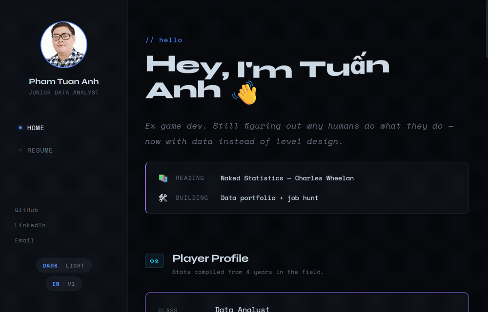

# Tuấn Anh — Data Analytics Portfolio

> **Junior Data Analyst** · SQL · Python · Machine Learning · Data Viz
> Ex game dev (5 titles shipped on Google Play), now figuring out why humans do what they do — with data instead of level design.

[](https://react.dev)
[](https://vite.dev)
[](https://recharts.org)
[](https://bio-ta.vercel.app/)

### ▶ [**Live site → bio-ta.vercel.app**](https://bio-ta.vercel.app/)



---

## Projects

Three end-to-end analyses — **raw data → SQL → Python/ML → a recommendation** — each with an interactive page of charts on the live site.

### 1. Recruit Analysis — what drives data salaries?

1.6M job postings across 160 countries (2023–2025); 77k with salary data.

- Built a regression model predicting **US annual salary**: **HistGradientBoosting, test R² 0.53** — it won a 5-fold cross-validation bake-off against Linear, Ridge, and Random Forest. MAE **$22.3k** vs a **$36.5k** mean baseline, across 79 engineered features.
- Restricting to US postings and adding a parsed seniority tier lifted test R² from **0.33 → 0.53** — the single biggest modeling win.
- Top salary drivers (permutation importance): seniority, skill count, and being based in CA/NY.

[SQL](sql/project1) · [Python analysis](project1_analysis.py)

### 2. Cookie Cats A/B Test — does moving the gate matter?

Mobile-game retention experiment: **90,189 players**, gate at level 30 vs level 40.

- 7-day retention favored gate-30 and was **statistically significant (χ² p = 0.0016)**. The 1-day difference was **not** (p = 0.076) — a useful reminder that early signals can mislead.
- Bootstrap mean difference **+0.83pp**, 95% CI **[0.34, 1.28]** — the effect holds up under resampling.
- **Recommendation:** keep the gate at level 30.

[SQL](sql/project2)

### 3. E-Commerce Segmentation — who are the best customers?

UCI Online Retail II: **541,909 transactions**, 4,372 customers, **£8.9M** revenue.

- **RFM segmentation** (Champions → Lost), a cohort-retention heatmap, and monthly revenue trends.
- 632 "Champions" drive the highest average revenue per customer — the segment worth protecting.

[SQL](sql/project3)

---

## Skills demonstrated

**SQL** (window functions, staged data marts) · **Python** (pandas, scikit-learn) · **Machine learning** (regression, model selection, feature engineering) · **A/B testing & inferential statistics** (χ², bootstrap confidence intervals) · **RFM & cohort analysis** · **React + Recharts** data-viz · **bilingual UI** (EN / VI)

---

## Tech stack

React 18 · Vite · Recharts · react-i18next · CSS Modules · Vitest. Deployed on Vercel.

## Run locally

```bash
git clone https://github.com/GPham62/bio-data-page.git
cd bio-data-page
npm install
npm run dev        # http://localhost:5173
```

Other scripts: `npm run build` · `npm run preview` · `npm test`.

## Project structure

```
src/
  pages/        # Home + one page per project (state-based routing in App.jsx)
  components/   # Reusable UI: charts, cards, section titles
  data/         # Per-project summary datasets (project1–3.js)
  locales/      # en.json + vi.json — every UI string, kept in parity
  utils/        # formatters, chart theme
sql/            # Source SQL for each project (project1–3)
docs/           # Walkthrough GIF + design notes
```

## Internationalization

The UI is fully bilingual (English / Tiếng Việt). Every user-facing string lives in both `src/locales/en.json` and `src/locales/vi.json`, which are always kept in parity.

## Deployment

Auto-deploys to [Vercel](https://bio-ta.vercel.app/) on every push to `main`.
